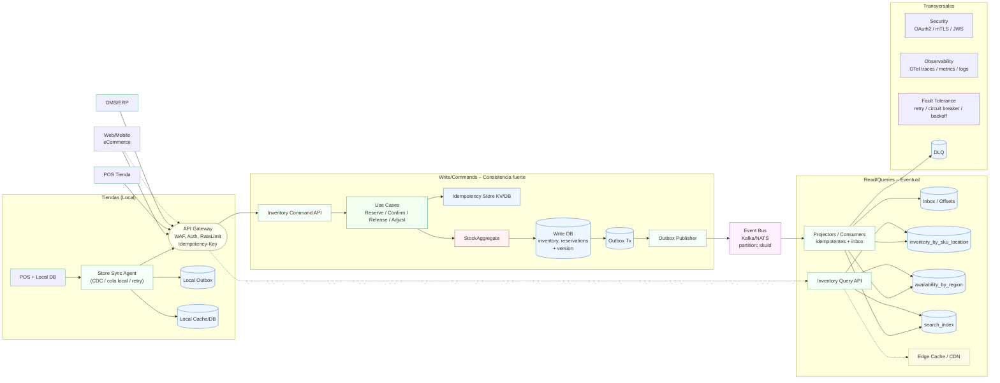
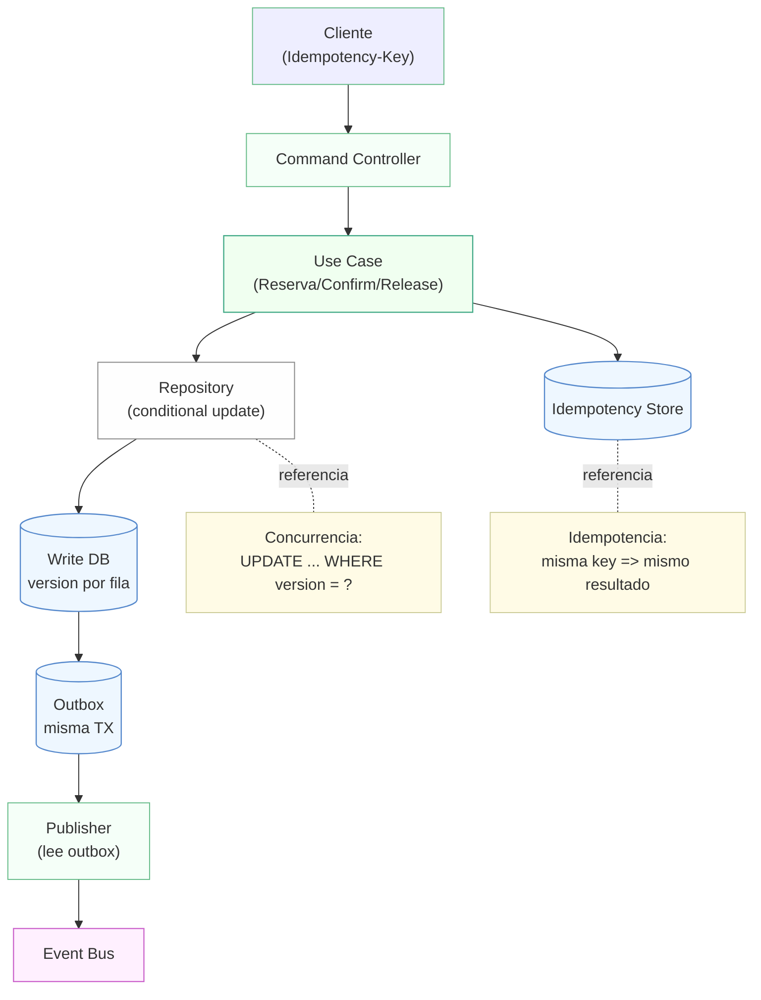
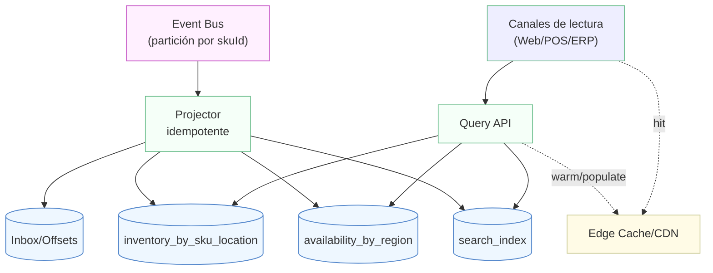

# Arquitectura de inventario distribuido

## Vista general

### Flujo detallado
1. Los distintos canales (eCommerce, POS y sistemas externos como OMS/ERP) envían peticiones al **API Gateway**, que protege el perímetro mediante WAF, autenticación, limitación de tasa e idempotencia.
2. En las tiendas físicas un *Store Sync Agent* realiza la captura de cambios en la base local y sincroniza comandos hacia el servicio central a través del gateway.
3. Los comandos ingresan al **Inventory Command API**, donde los *Use Cases* aplican la lógica para reservar, confirmar, liberar o ajustar stock. Cada comando verifica la clave de idempotencia para evitar repeticiones y actualiza el agregado `StockAggregate` en la base de escritura.
4. La transacción escribe en la base de datos de inventario y en una *outbox* transaccional. Un publicador lee la outbox y emite eventos al **Event Bus** particionado por `skuId` para garantizar orden por producto.
5. Los consumidores proyectan los eventos a diferentes modelos de lectura y mantienen un *inbox* de offsets para asegurar idempotencia. Los modelos alimentan la **Inventory Query API**, que puede apoyarse en cachés de borde.
6. Componentes transversales como seguridad, observabilidad y tolerancia a fallos protegen todos los flujos; los eventos que no pueden procesarse se envían a una **DLQ** para su análisis.

### Ejemplos de casos de uso
- **Reserva de stock** cuando un cliente inicia el checkout en la web.
- **Confirmación** tras el pago exitoso del pedido.
- **Liberación** de la reserva ante una cancelación o expiración.
- **Ajuste de inventario** por conteos físicos o recepción de mercadería.

### Caminos alternativos
- Si el comando llega con una `Idempotency-Key` ya utilizada, el sistema devuelve la misma respuesta previa sin reejecutar la lógica.
- Cuando dos procesos intentan actualizar la misma fila, la verificación de versión en la base de escritura evita la sobrescritura; el cliente debe reintentar con la versión actual.
- Si un consumidor falla al proyectar un evento, éste se envía a la **DLQ** para reprocesamiento manual.

### Justificación del diseño
- **Separación de comandos y consultas** permite obtener consistencia fuerte para escrituras y escalabilidad para lecturas.
- El patrón **outbox** garantiza que los eventos publicados al bus reflejen exactamente el estado confirmado en la base de datos.
- La **idempotencia** y el control de versiones previenen operaciones duplicadas y condiciones de carrera.
- El particionado por `skuId` en el bus mantiene el orden de los eventos relacionados con un mismo producto.

## Procesamiento de comandos e idempotencia

### Flujo detallado
1. El cliente envía un comando acompañado de una **Idempotency-Key**.
2. El *Command Controller* delega el procesamiento al *Use Case* correspondiente.
3. El caso de uso consulta el *Idempotency Store*; si la clave ya existe, retorna el resultado registrado.
4. Si es una operación nueva, el repositorio ejecuta una actualización condicional: `UPDATE ... WHERE version = ?`. Si la versión coincide, la fila se actualiza y se incrementa su versión.
5. En la misma transacción se escribe en la *outbox*. Un *publisher* independiente lee la outbox y publica el evento al bus.

### Ejemplos de casos de uso
- **Reserva**: decrementa stock disponible y crea una entrada de reserva.
- **Confirmación**: reduce la reserva y refleja la venta definitiva.
- **Liberación**: incrementa nuevamente el stock disponible eliminando la reserva.

### Caminos alternativos
- Si la versión no coincide (por una actualización concurrente), el repositorio no modifica la fila y el caso de uso devuelve un error de concurrencia para que el cliente reintente.
- Un comando repetido con la misma `Idempotency-Key` obtiene exactamente el mismo resultado previo.
- Si el comando supera validaciones de negocio (por ejemplo, stock insuficiente), se rechaza sin escribir en la outbox.

### Justificación del diseño
- Las actualizaciones condicionales y versiones por fila brindan **consistencia fuerte** y evitan pérdidas de actualización.
- El almacén de idempotencia facilita la **repetibilidad segura** de comandos ante fallos de red o reintentos automáticos.
- La outbox desacopla la publicación de eventos del procesamiento del comando, preservando atomicidad.

## Proyección y consultas

### Flujo detallado
1. Los eventos en el **Event Bus** se particionan por `skuId`, garantizando orden por producto.
2. Un *projector* idempotente consume los eventos, registra su progreso en un *inbox/offsets* y actualiza diversos modelos de consulta especializados: inventario por ubicación, disponibilidad por región e índices de búsqueda.
3. Los clientes de lectura consultan la **Query API**, que accede a estos modelos y puede precargar o responder desde una caché de borde/CDN.
4. Las respuestas cacheadas permiten minimizar la latencia para canales de alto tráfico.

### Ejemplos de casos de uso
- Mostrar **stock disponible por tienda** en la página de un producto.
- Calcular **disponibilidad por región** para estimar tiempos de entrega.
- Proveer un **buscador** de productos filtrable por existencia.

### Caminos alternativos
- Si el projector encuentra un evento duplicado, lo ignora gracias al *inbox* idempotente.
- Ante un fallo de red al consultar la Query API, los clientes pueden recurrir a la caché si está poblada.
- Una consulta no cacheada provoca un acceso directo al modelo de lectura y opcionalmente pobla el caché para futuras solicitudes.

### Justificación del diseño
- La separación en modelos de lectura específicos optimiza consultas con diferentes patrones de acceso.
- El uso de un *inbox* asegura proyecciones idempotentes y facilita reintentos sin duplicar información.
- La caché de borde reduce la latencia y descarga de los servicios centrales en escenarios de alta concurrencia.
