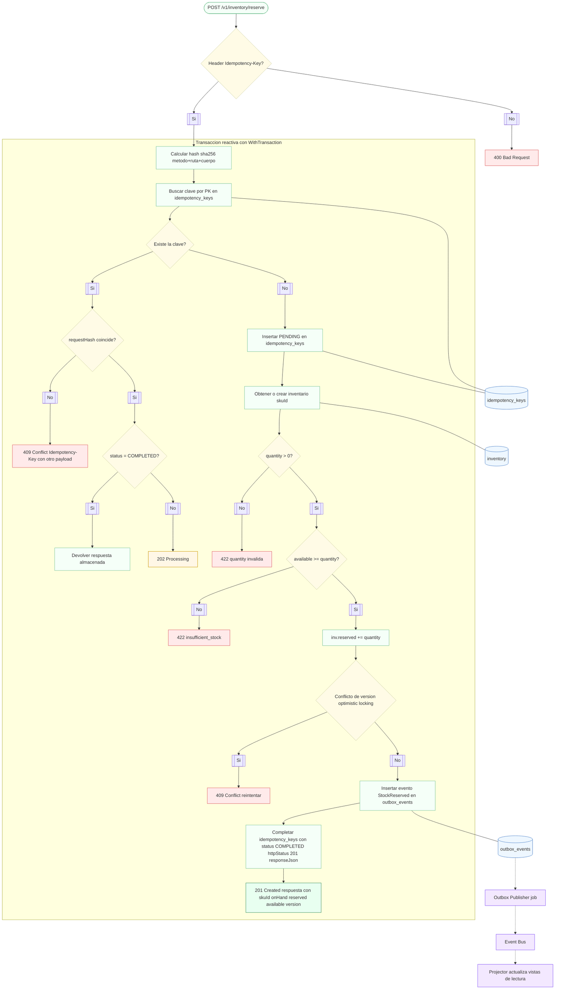
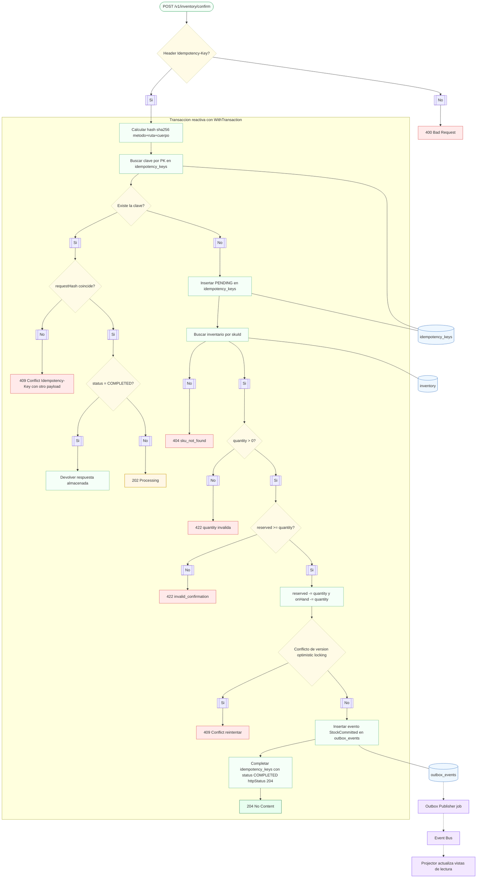
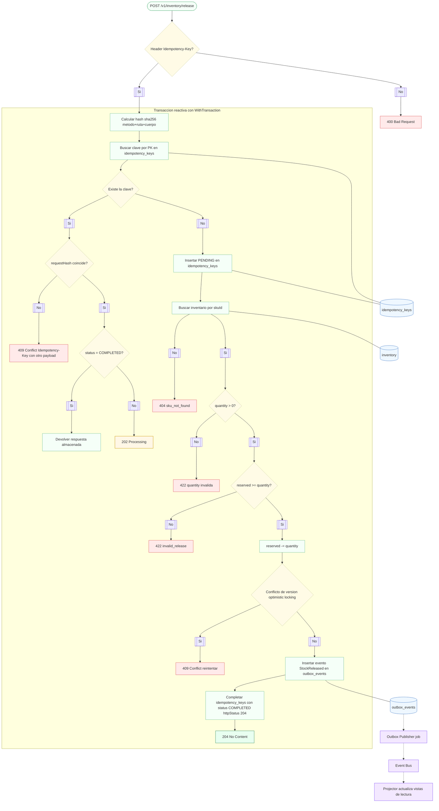
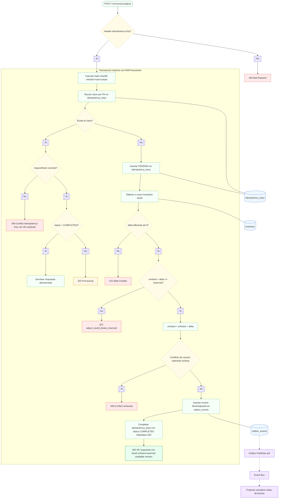

# Diagramas de flujo de casos de uso

Este documento describe los flujos internos de los casos de uso que componen la API de inventario: **reservar**, **confirmar**, **liberar** y **ajustar** stock. Cada sección incluye un diagrama Mermaid y una explicación paso a paso del proceso.

## Reserva

### Análisis
1. El endpoint exige un **Idempotency-Key**; su ausencia provoca un `400 Bad Request`.
2. Con la clave presente se calcula un hash del método, ruta y cuerpo para verificar reintentos con el mismo payload.
3. Dentro de una transacción reactiva se busca la clave:
   - Si ya existe y el `requestHash` difiere, se devuelve `409 Conflict` por uso indebido de la clave.
   - Si la clave existe y está **COMPLETED**, se responde con el resultado almacenado evitando reprocesar.
   - Si la clave existe pero no está completada, se informa `202 Processing` indicando que la operación original sigue en curso.
4. Si la clave no existe se registra como **PENDING** y se obtiene o crea el inventario del `skuId` solicitado.
5. Se validan reglas de negocio: `quantity > 0` y que haya `available` suficiente.
6. El agregado incrementa la reserva (`reserved += quantity`) usando bloqueo optimista; un conflicto de versión retorna `409` para que el cliente reintente.
7. Al confirmar la actualización se genera un evento `StockReserved` en la *outbox* y se completa la entrada de idempotencia con estado `COMPLETED` y respuesta `201`.
8. Un *publisher* externo procesa la outbox y emite el evento al bus, desde donde los *projectors* actualizan las vistas de lectura.

## Confirmación

### Análisis
1. El flujo inicial es idéntico al caso de reserva respecto a la validación de la clave de idempotencia y del `requestHash`.
2. Tras insertar la clave **PENDING** se busca el inventario del `skuId`; si no existe se responde `404 sku_not_found`.
3. Se valida que la cantidad sea positiva y que la reserva actual (`reserved`) sea suficiente para confirmar.
4. La confirmación reduce tanto `reserved` como `onHand`, reflejando una venta definitiva.
5. El update usa bloqueo optimista; los conflictos generan `409 Conflict` para reintentar.
6. Se emite un evento `StockCommitted` y se marca la transacción como **COMPLETED** con respuesta `204 No Content`.
7. Los projectores de lectura consumen el evento del bus y actualizan sus vistas.

## Liberación

### Análisis
1. La liberación comparte el mismo patrón de idempotencia y búsqueda del inventario que los casos anteriores.
2. Se valida que la cantidad sea positiva y que exista una reserva suficiente para liberar.
3. La operación sólo decrementa el campo `reserved`, devolviendo el stock al disponible sin modificar `onHand`.
4. Ante conflictos de versión se responde `409 Conflict` para permitir reintentos controlados.
5. Se genera un evento `StockReleased` y se completa la idempotencia con respuesta `204`.

## Ajuste

### Análisis
1. Se verifica el `Idempotency-Key` y el `requestHash` como en los demás casos.
2. Se obtiene o crea el inventario del `skuId` y se valida que el **delta** no sea cero.
3. La regla `onHand + delta >= reserved` evita dejar reservas sin respaldo de stock físico.
4. Si las validaciones pasan, se ajusta `onHand` sumando el delta positivo o negativo.
5. Un conflicto de versión produce `409 Conflict`; de lo contrario se emite `StockAdjusted` y se responde con los nuevos valores de inventario (`200 OK`).
6. Los projectores actualizarán las vistas de lectura tras consumir el evento.
